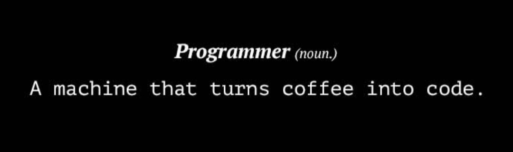

# Hello, folks!  👋

My name is Paridhi Jain and I'm a final year Ungergraduate student persuing my Bachelor's of engineering from V.V.P Engineering College,Rajkot. I would like to showcase what I have contributed in 3 years of my engineering as a developer and in technical field.

✔ I am working as a Core tech team member of <b>Developers Student Club.</b>

✔ I have worked as a Data Analyst Intern at <b>The Sparks Foundation.</b>

✔ I have worked as an Executive Counsellor at <b>Careers360.</b>

## What am I learning right now?

Well, I think a developer has to learn new skills every single day of his/her life. And It is more important to practice them rather than just learning endlessly. 

- I am currently learning <b>Web developement with MERN stack.</b>
- I have made some frontend projects with <b>React.js framework.</b>
- I am practicing <b>Deep learning Concepts.</b>
- I am working on some projects related to <b>OpenCV with python.</b>

<h3 align="center">CAN YOU TOO RELATE?</h3>
<h5 align="center">You will get challenges each and every day but when you come out of it, nothing is better than that 6 hour long still satisfying sleep.</h5>

